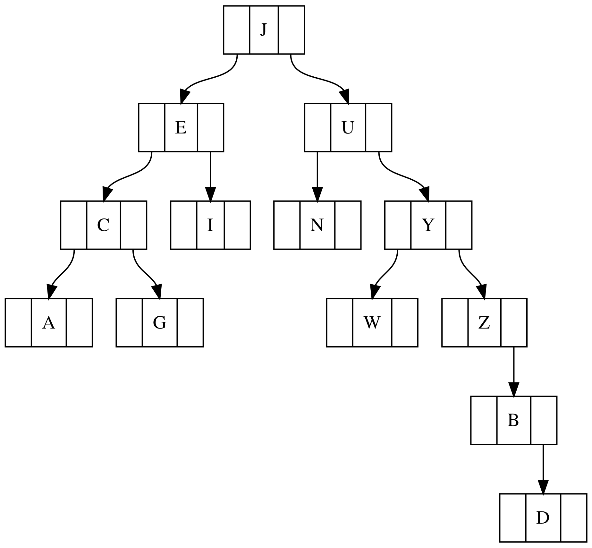

# **Go语言里的二叉树**

**二叉树**是一种每个节点下方最多只能有两个节点的数据结构。其意味着一个节点能连接到一至两个子节点，或者没有任何子节点。**树的根节点**就是树的第一个节点。**树的深度**（也称**树的高度**），指的就是从根节点到任一节点最长的一条路径。**节点的深度**就是指从该节点到树的根节点所经过的路径里边的数量。**叶节点**就是没有任何子节点的节点。

当树的根节点到叶节点的最大距离和根节点到叶节点的最短距离之差不大于1时，则认为这个树为**平衡的**。反之则为**非平衡树**。树的平衡操作可能是困难又缓慢的，所以最好一开始就让你的树保持平衡，而不是在创建后再去平衡它，尤其是当你的树有很多节点的时候。

下图展示了一个非平衡树，其根节点为J，叶节点为A，G，W和D。

