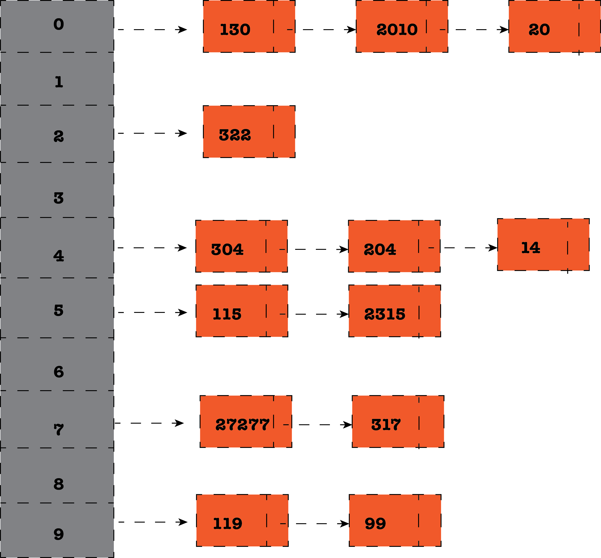

# **Go语言里的哈希表**

严格来说，哈希表是一种以一个或多个键值对存储的数据结构，其使用了一个 **哈希函数** 来通过存放在存储桶或槽里的索引计算找出正确的值。理想情况下，哈希函数应该将每一个键和存储桶一一对应，前提是你得拥有足够的存储桶。

一个好的哈希函数其生成的哈希值一定要是均匀分布的，如果存在未使用的存储桶或者存储桶的差异很大，那么其工作效率将会很低。此外，哈希函数应该具有一致性，对于相同的键值其需要输出相同的哈希值，否则将无法找到想要的信息。

下图展示了一个拥有10个存储桶的哈希表：

