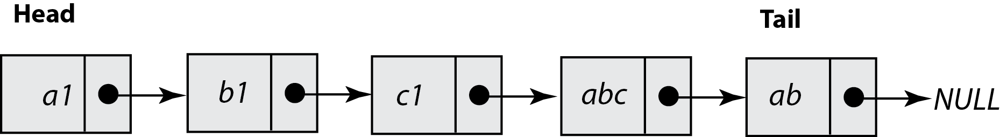
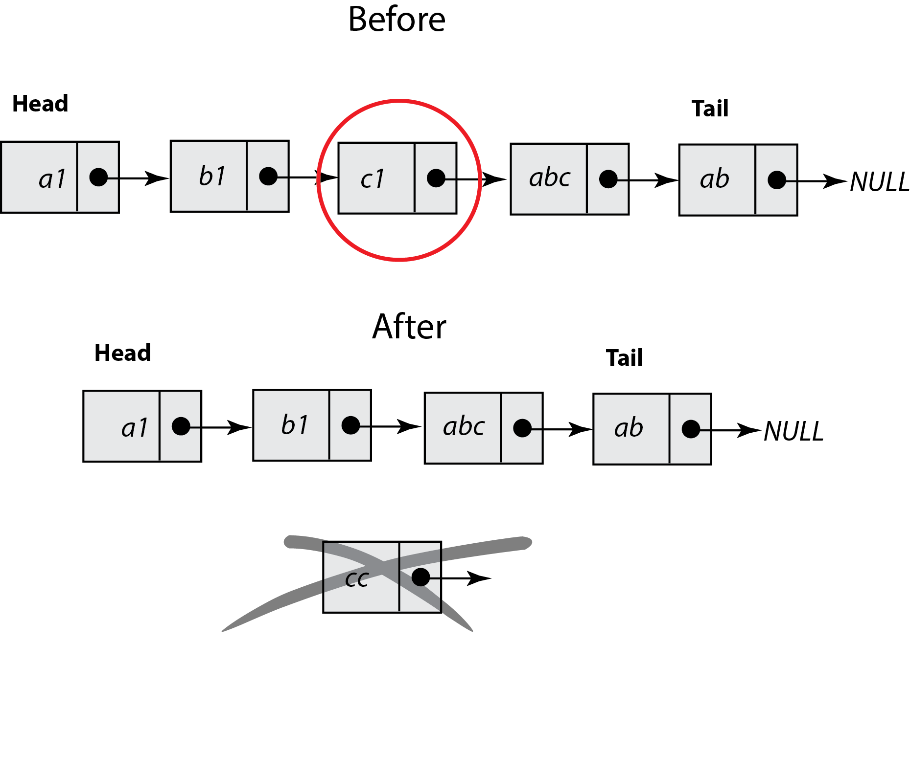

# **Go语言里的链表**

链表是一种包含有限元素集的数据结构，其每个元素至少使用了两个内存位置：一个是用于存储实际的数据，另一个是用于存储将当前元素链接到下一个元素的指针，链表就是由这些元素构建出来的。

链表的第一个元素称之为**头**，最后一个元素称之为**尾**。在定义链表的过程中，你需要做的第一件事就是将链表头使用单独的变量保存，因为链表头是访问整个链表的唯一方式。注意，如果你丢失了指向单向链表第一个节点的指针，那就再也找不到它了。

下图展示了一个拥有5个节点的链表：

下图向你展示了如何将一个节点从链表中移除，以便更好的理解该过程中所涉及到的步骤。你需要做的就是调整被删除节点的左节点的指针，使其指向被删除节点的右节点。

接下来要实现的链表功能将会相对简单，其中不包含删除节点的功能。该功能的实现将会是你的练习题。

